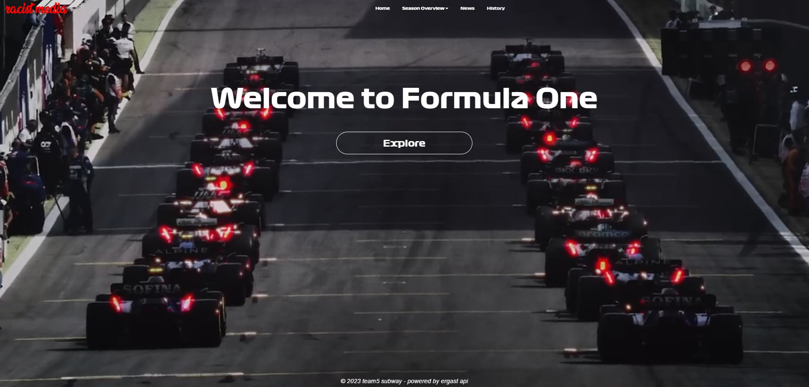
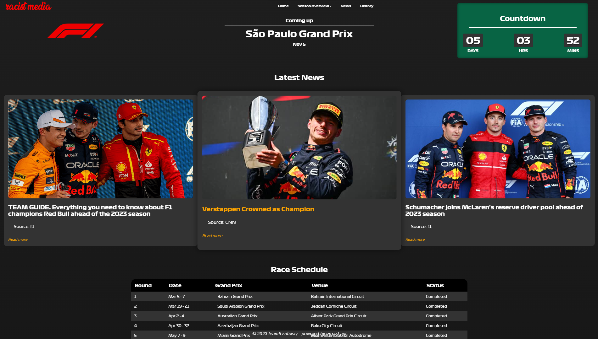
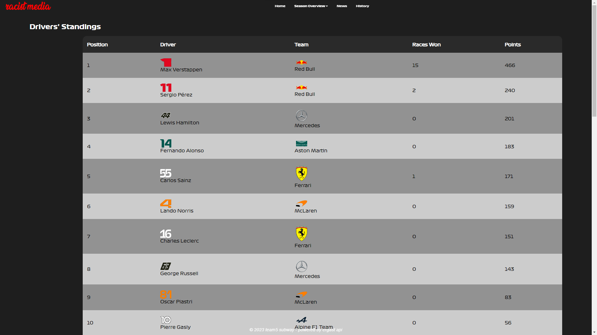
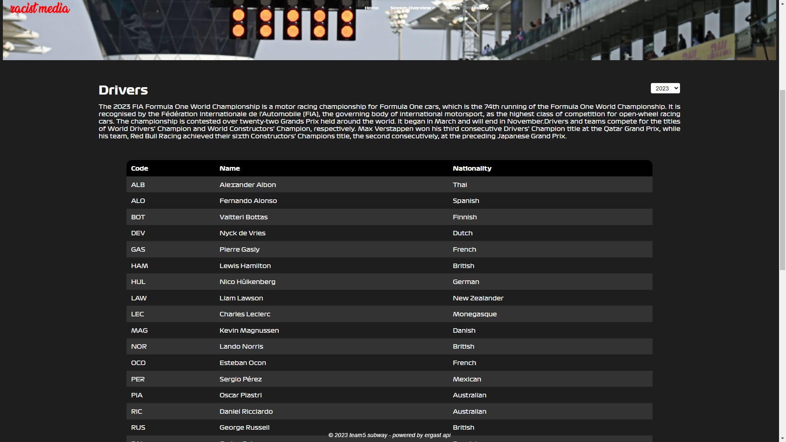
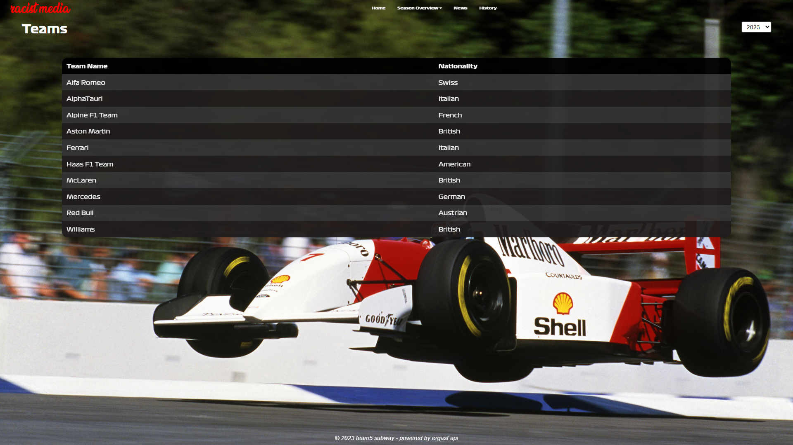
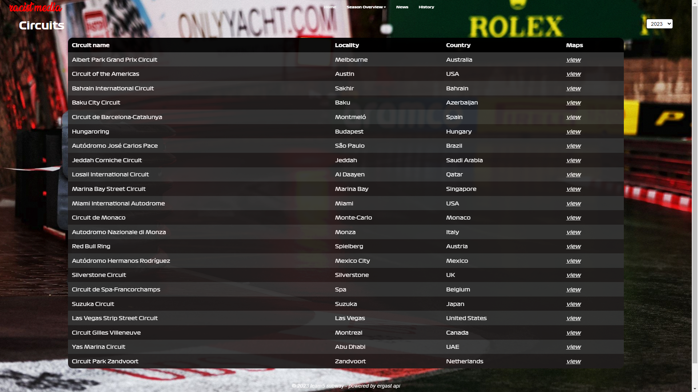

# F1TW - One Stop Formula One Outlewt

## TEAM 5 Subway - ACTIVITY 3-2



F1TW is a web application dedicated to providing Formula One enthusiasts with up-to-date information about the world of Formula 1 racing. Whether you're a seasoned fan or just getting started, this website has something for everyone.

## Features

- **Homepage:** Get the latest F1 News as well as the upcoming race, be updated on when the next race with our countdown



- **Standing:** View the current standings as well as the score of the teams and drivers for the current Formula One Season.



- **Drivers and Teams Information:** Learn about the drivers and constructors participating in the current season, including team details and driver profiles.




- **Circuit Information:** Discover detailed information about each circuit on the race calendar, including track layout, history, and notable moments.



- **News and Highlights:** Stay updated with the latest Formula One news, highlights, and event coverage.

- **History:** Learn more about the history of Formula One

## Usage

Clone the repository to your local machine:

   ```git clone https://gitlab.com/2223201/team5_webtek2.git```

screw around and find out
